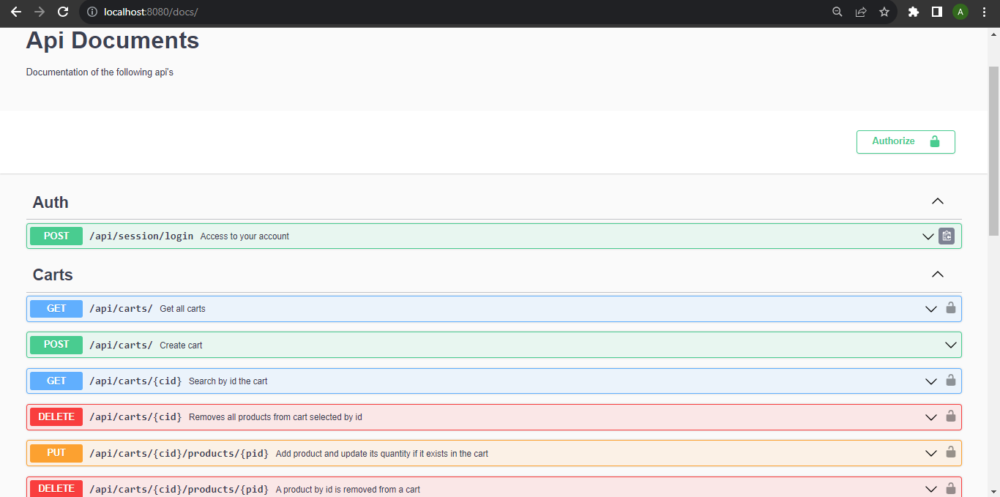

# Proyecto Final Backend

Proyecto finalizado y deployado durante la cursada de backend en Coderhouse 2023.\
Este proyecto cuenta con la arquitectura MVC (Modelo-Vista-Controlador) que es un patrón de arquitectura/diseño que separa una aplicación en tres componentes lógicos principales Modelo, Vista y Controlador.

## Link del proyecto deployado

Este proyecto esta deployado en Render.com mediante este repositorio alojado en esta plataforma.\
LINK : https://backend-ecommerce-1haw.onrender.com/login

## Ejecucion de app

Si ejecutas **npm run dev** corre con nodemon.\
Si ejecutas **npm run start** corre con node.

## Para su uso
Es necesario installar `NODE.JS` & `NODEMON` de manera global\
Para el uso del repositorio debe instarlar todas las dependecias correspondientes ejecutando **npm i**.

## Api docs
Se puede probar diferentes endpoints tanto como :\
Sesiones    : Registrarse y loggearse como usuario.\
Productos   : Crear, leer , actualizar , eliminar un producto.\
Cart        : Añadir o eliminar un producto, borrar todos los productos del carrito o crear un opcion de compra del carrito.\
Usuarios    : buscar varios o un usuario y actualizar informacion de un usuario.\

